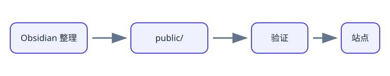

# Java 基础

本模块建立阅读和编写 Java 程序所需的最小语言基础，为后续面向对象与框架学习提供共同词汇。

## 核心概念地图

- 基本类型、引用类型与变量
- 表达式、运算符与控制流程
- 数组、字符串和方法
- 参数传递、作用域与生命周期
- 异常分类、捕获与传播
- 包、访问控制与基本工程结构

## 推荐复习顺序

先确认类型和方法调用，再复习控制流程、异常与包结构。遇到代码行为不符合预期时，优先检查类型转换、对象引用和异常传播路径。

## 已公开内容

- [官方 Java 学习指南](dev-java-learn.md)：用 dev.java 的现代 Java 教程校准语言基础，并按学习阶段选择专题。

## 最小示例

```java
static int add(int left, int right) {
    return left + right;
}
```

该示例只执行固定次数的操作，可以记作时间复杂度 $O(1)$。

| 检查点 | 应该能回答的问题 |
| --- | --- |
| 类型 | 基本类型与引用类型的差异是什么？ |
| 方法 | Java 参数传递的准确含义是什么？ |
| 异常 | 受检异常与非受检异常如何选择？ |

## 快速自测

1. `==` 在基本类型和引用类型上分别比较什么？
2. 方法参数重新赋值为什么不会替换调用方变量？
3. `finally` 通常用于解决什么问题？

!!! warning "复习提醒"

    不要只记语法形式；应当能通过一个最小程序解释变量、对象与调用栈之间的关系。


